📊 DB Project – Stage A
🍽️ Ordering Restaurants System

👩‍💻 Submitted by
Idit Cohen - 329194229
Ester Garada - 214881229

📑 Table of Contents
    Introduction
    System Screens
    Database Design (ERD + DSD)
    Design Decisions
    Data Insertion Methods
    Backup & Restore

📌 Introduction
This system is designed to provide users with information about restaurants and allow them to interact with the system after logging in.

The system enables users to:
    Search for restaurants by city, country, restaurant name, or personal profile preferences
    View restaurant details such as name, description, address, cuisine type, and average price
    Make reservations (bookings)
    Write feedback and reviews for restaurants
The goal of the system is to create an easy and efficient platform for users to explore restaurants, make reservations, and share their experiences.

🖥️ System Screens
The system includes 4 main screens:

Login / Register Screen
    Allows users to log in or create a new account
    


Profile Setup Screen
    Users enter personal details such as country, age, and preferences
    
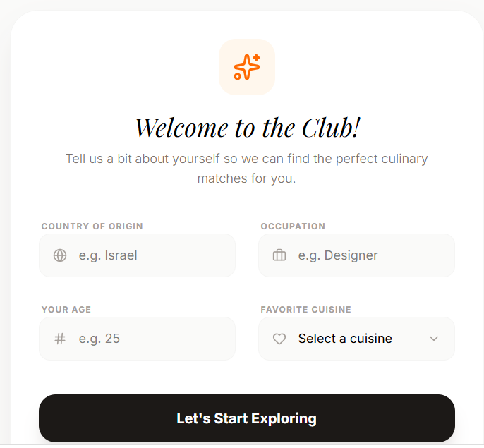

Home Screen (Navigation Dashboard)
    Main screen after login
    Includes navigation bar:
        Home
        Search by Location
        Search by Name
        Search by Profile
        
  

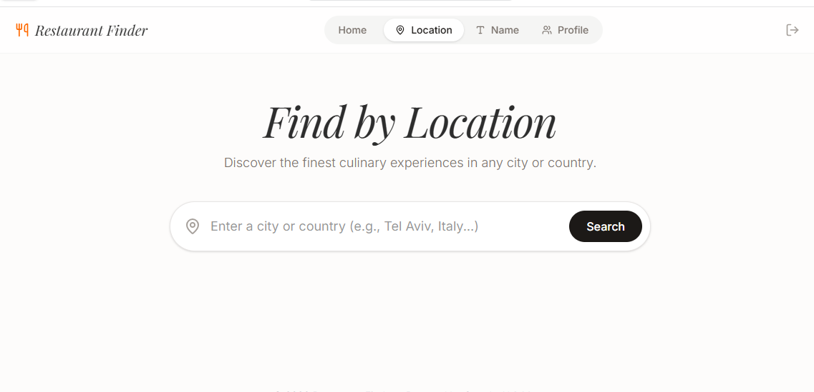

Search & Restaurant Interaction Screen
    Displays restaurant results
    Allows users to:
        View restaurant details
        Make reservations
        Leave feedback
        


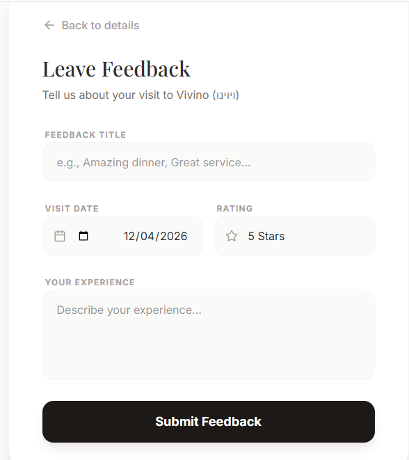


🔗 Link to AI Studio:
https://aistudio.google.com/apps/c8450de9-342a-45b4-97ab-09c26e8ec42a?showPreview=true&showAssistant=true


🗄️ Database Design
ERD Diagram

📸 
**[Download Original File (ERDPlus)](Stage A/ERD_Diagram.erdplus)**

DSD Diagram

📸 


⚙️ Design Decisions
During the design process, the following decisions were made:

The system includes more than 6 entities:
Tourist
Restaurant
Booking
Feedback
Rating
City
Country
The database includes important DATE fields such as:
Booking_Date
Feedback_Date
The database was normalized to at least 3NF to prevent redundancy and ensure data consistency
Relationships were defined using foreign keys to maintain data integrity
Constraints were added (such as UNIQUE fields for email and phone) to ensure valid and realistic data

📜 SQL Scripts
1. Create Tables Script

This file contains all SQL commands required to create the database tables based on the designed schema (ERD & DSD).
It defines tables, primary keys, foreign keys, and constraints.

🔗[create_table.sql](init-db/create_table.sql)

2. Drop Tables Script

This file includes SQL commands to safely delete all tables from the database in the correct order, preventing dependency errors between tables.

🔗 [dropTables.sql](init-db/dropTables.sql)

3. Insert Data Script

This file contains SQL INSERT statements used to populate the database with initial data for all tables.

🔗 [insertTables.sql](init-db/insertTables.sql)

4. Select Queries Script

This file includes SELECT queries that retrieve and display all data from the database tables, used for testing and verification.

🔗 [selectAll.sql](init-db/selectAll.sql)

## Data Population Methods

In this project, data was populated using three different methods:

1. **Python Script Generation**
   A Python script was used to generate large-scale synthetic data (e.g., 20,000 booking records). The script creates realistic randomized values and exports them into CSV files.

   

3. **External Data Generation Tool (Mockaroo)**
   The Mockaroo website was used to generate structured and realistic datasets for related tables (such as tourists and restaurants).

   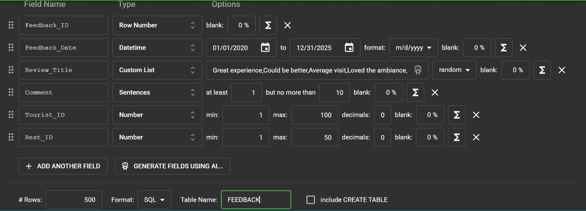

   

5. **Bulk Import Using CSV (COPY command)**
   The generated CSV files (from Python) were loaded into the database using the SQL `COPY` command for efficient bulk insertion.

   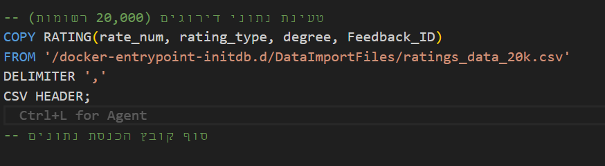

💾 Backup & Restore

 A backup file was created for the database
 The backup file includes the date of creation
 The backup was successfully restored on another computer
 
🔗 Backup File:
[Open Backup File](https://github.com/esterG9/RestaurantProject/blob/main/restaurant_backup_14_04_26%20(1))

📸 Screenshot of backup
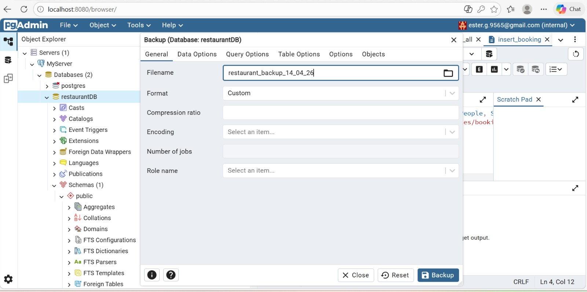
📸 Screenshot of restore
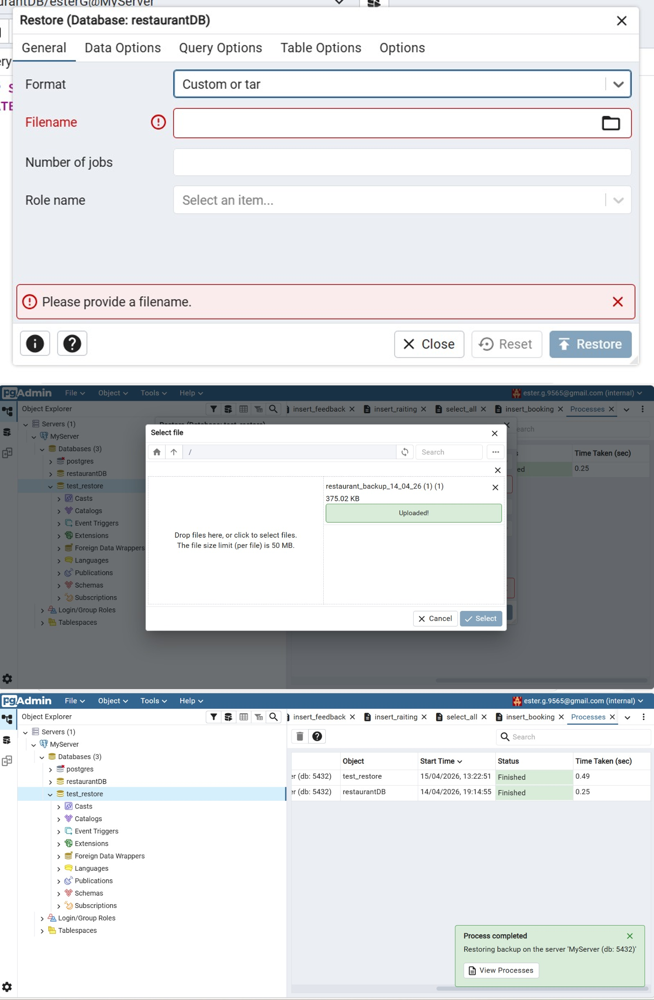

DSD diagram from pgAdmin

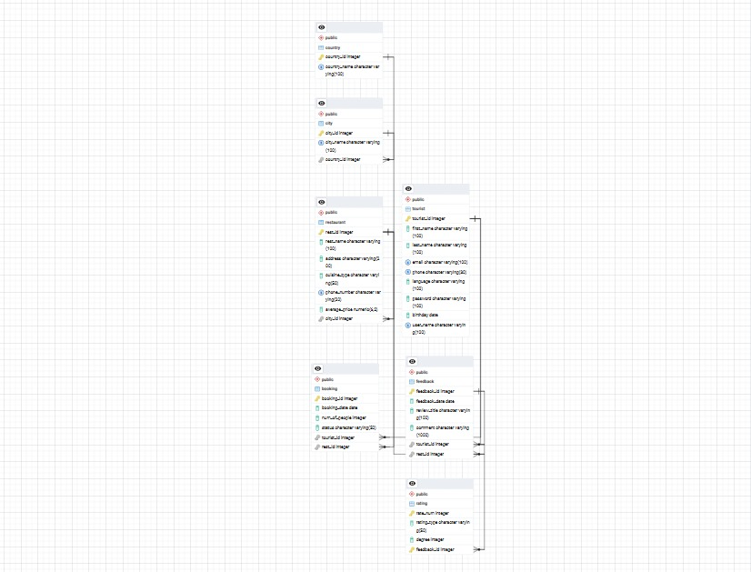

**Stage B**

**שאילתות SELECT**

1.שאילתת חיפוש מסעדה על פי מיקום
שיטה ראשונה
```sql
SELECT r.Rest_Name, r.Address, c.City_Name, co.Country_Name
FROM RESTAURANT r
JOIN CITY c ON r.City_ID = c.City_ID
JOIN COUNTRY co ON c.Country_ID = co.Country_ID
WHERE TRIM(co.Country_Name) LIKE 'Albania'
ORDER BY r.Rest_Name;
```

 שיטה שניה

```sql
SELECT 
    r.Rest_Name, 
    r.Address, 
    (SELECT c.City_Name FROM CITY c WHERE c.City_ID = r.City_ID) AS City_Name,
    (SELECT co.Country_Name FROM COUNTRY co 
     JOIN CITY ci ON co.Country_ID = ci.Country_ID 
     WHERE ci.City_ID = r.City_ID) AS Country_Name
FROM RESTAURANT r
WHERE r.City_ID IN (
    SELECT c.City_ID FROM CITY c WHERE c.Country_ID = (
        SELECT co.Country_ID FROM COUNTRY co WHERE TRIM(co.Country_Name) = 'Albania'
    )
)
ORDER BY r.Rest_Name;
```

השיטה הראשונה עם JOIN טובה ויעילה יותר, כי היא מחברת את הטבלאות בצורה ישירה וברורה. השיטה השנייה משתמשת בתתי־שאילתות, ולכן היא יותר מסורבלת ועלולה להיות איטית יותר כי היא מבצעת בדיקות פנימיות נוספות.


2.שאילתת חיפוש מסעדה על פי דירוג
שיטה ראשונה

```sql
SELECT r.Rest_Name, r.Cuisine_Type, r.Average_Price
FROM RESTAURANT r
WHERE EXISTS (
    SELECT 1 
    FROM FEEDBACK f
    JOIN RATING ra ON f.Feedback_ID = ra.Feedback_ID
    WHERE f.Rest_ID = r.Rest_ID AND ra.degree = 5
)
ORDER BY r.Average_Price DESC;
```
 שיטה שניה

```sql
SELECT Rest_Name, Cuisine_Type, Average_Price
FROM RESTAURANT
WHERE Rest_ID IN (
    SELECT f.Rest_ID
    FROM FEEDBACK f
    JOIN RATING ra ON f.Feedback_ID = ra.Feedback_ID
    WHERE ra.degree = 5
)
ORDER BY Average_Price DESC;
```

השיטה הראשונה עם EXISTS עדיפה כאן, כי היא בודקת אם קיימת לפחות ביקורת אחת עם דירוג 5 ועוצרת כשנמצאה התאמה. השיטה השנייה עם IN קודם יוצרת רשימה של מסעדות מתאימות ואז בודקת מול הרשימה, ולכן יכולה להיות פחות יעילה.


3.שאילתה להצגת ביקורות למסעדה מהחדשות לישנות
שיטה ראשונה
```sql
SELECT
    f.Feedback_ID,
    res.Rest_Name,
    t.First_Name,
    t.Last_Name,
    f.Feedback_Date,
    f.Review_Title,
    f.Comment
FROM FEEDBACK f
JOIN RESTAURANT res
    ON f.Rest_ID = res.Rest_ID
JOIN TOURIST t
    ON f.Tourist_ID = t.Tourist_ID
WHERE res.Rest_Name = 'Jayo'
ORDER BY f.Feedback_Date DESC;
```
 שיטה שניה

```sql
SELECT
    f.Feedback_ID,

    (SELECT res.Rest_Name
     FROM RESTAURANT res
     WHERE res.Rest_ID = f.Rest_ID) AS Rest_Name,

    (SELECT t.First_Name
     FROM TOURIST t
     WHERE t.Tourist_ID = f.Tourist_ID) AS First_Name,

    (SELECT t.Last_Name
     FROM TOURIST t
     WHERE t.Tourist_ID = f.Tourist_ID) AS Last_Name,

    f.Feedback_Date,
    f.Review_Title,
    f.Comment
FROM FEEDBACK f
WHERE f.Rest_ID IN (
    SELECT res.Rest_ID
    FROM RESTAURANT res
    WHERE res.Rest_Name = 'Jayo'
)
ORDER BY f.Feedback_Date DESC;
```

השיטה הראשונה עם JOIN יעילה וברורה יותר, כי היא מחברת את הביקורות ישירות למסעדה ולתייר. השיטה השנייה משתמשת בתתי־שאילתות עבור כל שורה, ולכן היא פחות יעילה ויותר קשה לקריאה.

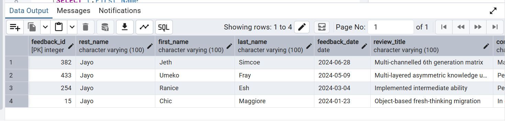


4.הצגת מספר הזמנות לכל תייר
שיטה ראשונה
```sql
SELECT
    t.Tourist_ID,
    t.First_Name,
    t.Last_Name,
    COUNT(b.Booking_ID) AS Num_Of_Bookings
FROM TOURIST t
LEFT JOIN BOOKING b
    ON t.Tourist_ID = b.Tourist_ID
GROUP BY
    t.Tourist_ID, t.First_Name, t.Last_Name
ORDER BY Num_Of_Bookings DESC;
```

שיטה שניה
```sql
SELECT
    t.Tourist_ID,
    t.First_Name,
    t.Last_Name,

    (SELECT COUNT(*)
     FROM BOOKING b
     WHERE b.Tourist_ID = t.Tourist_ID) AS Num_Of_Bookings

FROM TOURIST t
ORDER BY Num_Of_Bookings DESC;
```

השיטה הראשונה עם LEFT JOIN ו־GROUP BY טובה יותר, כי היא מחשבת את מספר ההזמנות לכל התיירים ביחד. השיטה השנייה סופרת הזמנות בנפרד עבור כל תייר, ולכן יכולה להיות איטית יותר בטבלה גדולה.


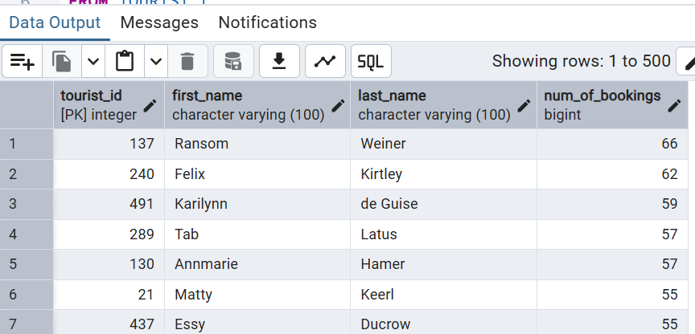


5.השאילתה מציגה את מספר ההזמנות שבוצעו בחודש ושנה מסוימים
```sql
SELECT 
    Booking_ID,
    Booking_Date,
    Num_Of_People,
    Status,
    Tourist_ID
FROM BOOKING
WHERE EXTRACT(YEAR FROM Booking_Date) = 2025
  AND EXTRACT(MONTH FROM Booking_Date) = 1
ORDER BY Booking_Date;
```

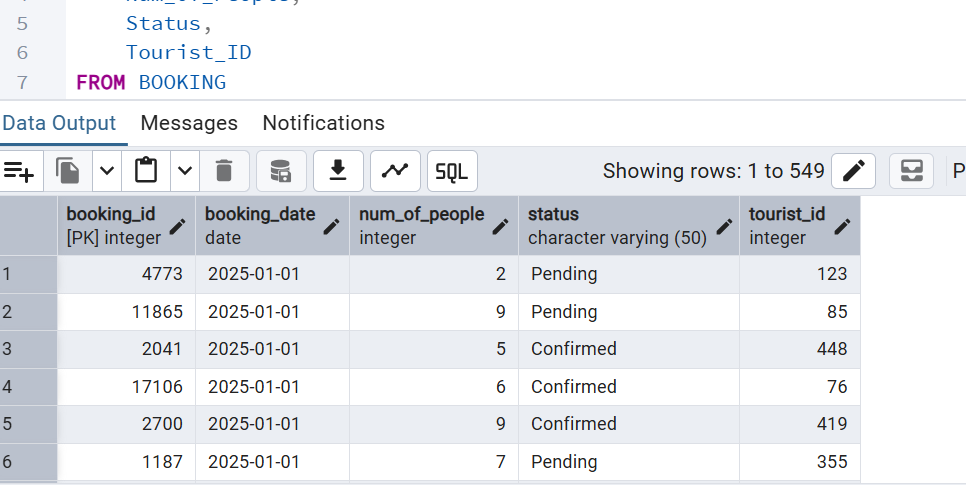


6.מי הם 5 התיירים הכי פעילים שביצעו הכי הרבה הזמנות מאושרות
```sql
SELECT 
    t.First_Name, 
    t.Last_Name, 
    t.Email, 
    COUNT(b.Booking_ID) AS Total_Confirmed_Bookings,
    MAX(b.Booking_Date) AS Last_Booking_Date
FROM TOURIST t
JOIN BOOKING b ON t.Tourist_ID = b.Tourist_ID
WHERE b.Status = 'Confirmed'
GROUP BY t.Tourist_ID, t.First_Name, t.Last_Name, t.Email
HAVING COUNT(b.Booking_ID) > 1
ORDER BY Total_Confirmed_Bookings DESC
LIMIT 5;
```

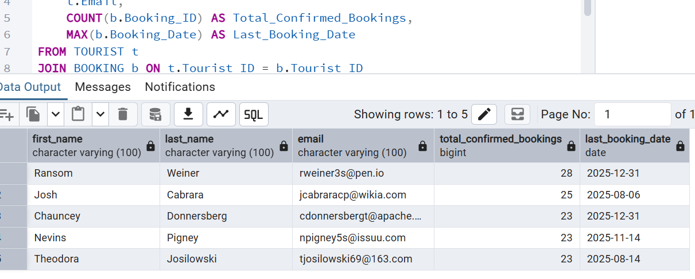


7.הזמנות שבוטלו
```sql
SELECT
    b.Booking_ID,
    b.Booking_Date,
    b.Num_Of_People,
    b.Status,
    t.First_Name,
    t.Last_Name,
    r.Rest_Name
FROM BOOKING b
JOIN TOURIST t
    ON b.Tourist_ID = t.Tourist_ID
JOIN RESTAURANT r
    ON b.Rest_ID = r.Rest_ID
WHERE b.Status = 'Cancelled'
ORDER BY b.Booking_Date DESC;
```

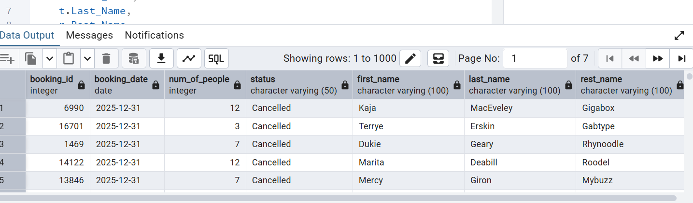


8.הצגת המסעדה הכי זולה בכל עיר ולכל סוג מטבח
```sql
SELECT
    c.City_Name,
    r.Cuisine_Type,
    r.Rest_Name,
    r.Average_Price
FROM RESTAURANT r
JOIN CITY c
    ON r.City_ID = c.City_ID
WHERE r.Average_Price = (
    SELECT MIN(r2.Average_Price)
    FROM RESTAURANT r2
    WHERE r2.City_ID = r.City_ID
      AND r2.Cuisine_Type = r.Cuisine_Type
)
ORDER BY
    c.City_Name,
    r.Cuisine_Type,
    r.Rest_Name;
```

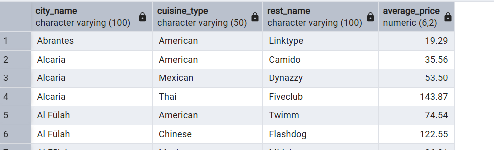


**שאילתות UPDATE**

1. שאילתה שמעדכנת סטטוס הזמנות שעבר זמנן ל -Completed
```sql
UPDATE BOOKING
SET Status = 'Completed'
WHERE Booking_Date < CURRENT_DATE
  AND Status = 'Confirmed';
```
בסיס הנתונים לפני העדכון:

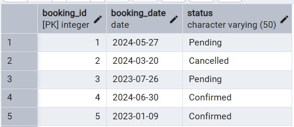

בסיס הנתונים אחרי העדכון:

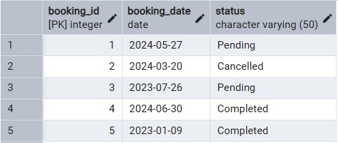


2. שאילתה שמעלה את המחיר של מסעדות בעיר - Fier

```sql
UPDATE RESTAURANT
SET Average_Price = Average_Price * 1.10
WHERE City_ID IN (
    SELECT City_ID
    FROM CITY
    WHERE City_Name = 'Fier'
);
```
בסיס הנתונים לפני העדכון:

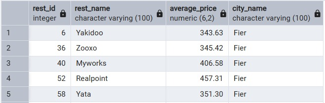

בסיס הנתונים אחרי העדכון:

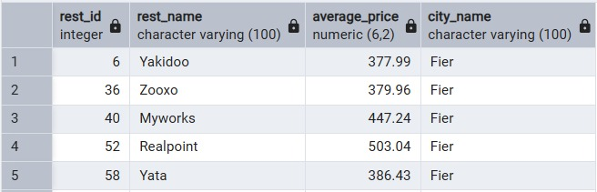


3. שאילתה שמאפסת סיסמאות לפי פרטי המשתמש - יוצרת סיסמה לפי שנת לידה, שם ומזהה

```sql
UPDATE TOURIST
SET password =
    TO_CHAR(birthday, 'YYYY') || First_Name || Tourist_ID;
```
בסיס הנתונים לפני העדכון:

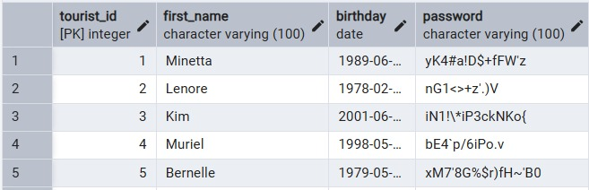

בסיס הנתונים אחרי העדכון:

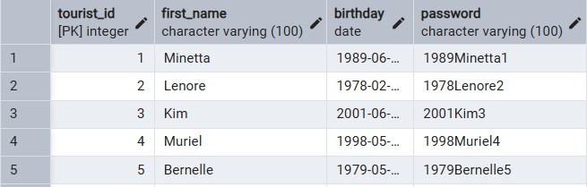


**שאילתות DELETE**


--1.שאילתה מוחקת את ההזמנות שהושלמו או בוטלו לתייר שכתובת המייל שלו היא 'cwessell5@skype.com'
```sql
DELETE FROM BOOKING
WHERE TRIM(Status) IN ('Confirmed', 'Cancelled')
  AND Tourist_ID = (
    SELECT Tourist_ID 
    FROM TOURIST 
    WHERE TRIM(Email) = 'cwessell5@skype.com'
);

```
.png)

.png)


--2.שאילתה מוחקת דירוגים גרועים למסעדה ספציפית
```sql
DELETE FROM RATING
WHERE degree = 1 
  AND Feedback_ID IN (
    SELECT Feedback_ID 
    FROM FEEDBACK 
    WHERE Rest_ID IN (
        SELECT Rest_ID 
        FROM RESTAURANT 
        WHERE TRIM(Rest_Name) = 'Jayo'
    )
);
```

.png)

.png)


--3.שאילתה שמוחקת מסעדות שלא הוזמנו בהם הזמנות
```sql
DELETE FROM RESTAURANT
WHERE Rest_ID NOT IN (
    SELECT DISTINCT Rest_ID 
    FROM BOOKING
);
```
.png)

.png)

**אילוצים**

--1.אילוץ על מספר אנשים להזמנה לפחות 1 והכמות לא תעלה על 20
תיאור השינוי: הוספת אילוץ CHECK לטבלת BOOKING שמוודא כי מספר האנשים בהזמנה (Num_Of_People) הוא תמיד חיובי (גדול מ-0) ולא עולה על 20, כדי למנוע טעויות הקלדה או הזמנות לא הגיוניות.

```sql
ALTER TABLE BOOKING 
ADD CONSTRAINT chk_num_people_range 
CHECK (Num_Of_People > 0 AND Num_Of_People <= 20);
```
--בדיקה
```sql
INSERT INTO BOOKING (Booking_ID, Tourist_ID, Rest_ID, Booking_Date, Num_Of_People, Status)
VALUES (999999, 1, 1, '2026-05-04', 25, 'Confirmed');
```
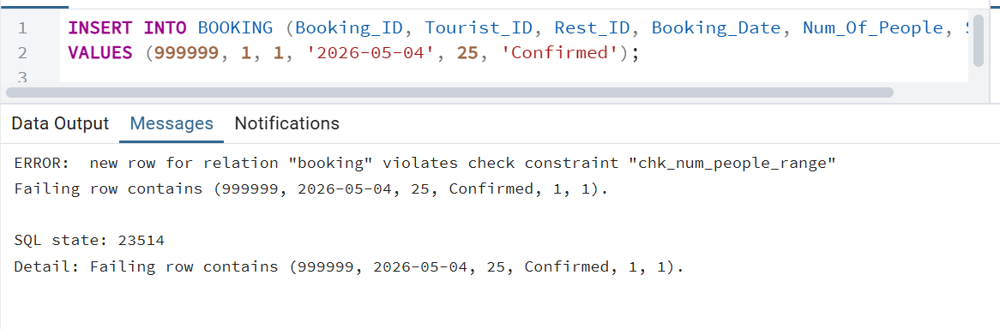


--2.אילוץ על מספר הטלפון של המסעדה חייב להיות מספרים בלבדאו סימן ידוע למספר טלפון
תיאור השינוי: הוספת אילוץ CHECK המשתמש בביטוי רגולרי (Regular Expression) כדי לוודא שמספר הטלפון של המסעדה מכיל ספרות בלבד (או תווים בסיסיים כמו מקף). זה מוודא שלא יוכנס טקסט חופשי לעמודת הטלפון.
```sql
ALTER TABLE RESTAURANT 
ADD CONSTRAINT chk_rest_phone_numeric 
CHECK (Phone_Number ~ '^[0-9+\-]+$');
```
-- בדיקה
```sql
UPDATE RESTAURANT 
SET Phone_Number = 'Call-Me-Now' 
WHERE Rest_ID = (SELECT MIN(Rest_ID) FROM RESTAURANT);
```
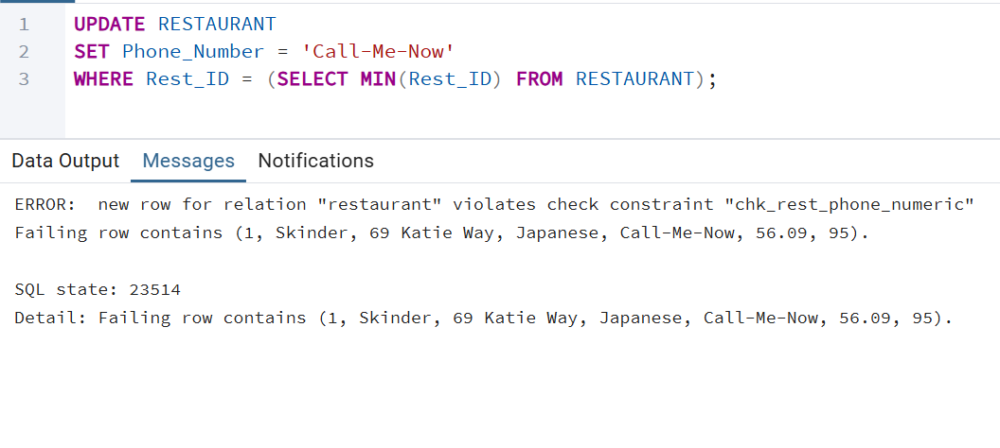

--3.אילוץ על תאריך המשוב לא יהיה בעתיד
תיאור השינוי: הוספת אילוץ CHECK לטבלת FEEDBACK המבטיח שתאריך המשוב (Feedback_Date) יהיה קטן או שווה לתאריך הנוכחי (CURRENT_DATE). זה מונע "זיוף" של משובים עתידיים או טעויות הקלדה בשנה.
```sql
ALTER TABLE FEEDBACK 
ADD CONSTRAINT chk_feedback_not_future 
CHECK (Feedback_Date <= CURRENT_DATE);
```
--בדיקה
```sql
INSERT INTO FEEDBACK (Feedback_ID, Feedback_Date, Review_Title, Comment, Tourist_ID, Rest_ID)
VALUES (888888, '2028-01-01', 'Future Meal', 'The food was great in the future!', 1, 1);
```
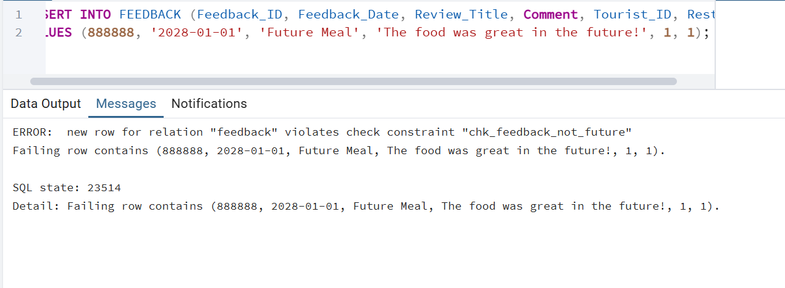

**ROLLBACK & COMMIT**

**הדגמת ROLLBACK**

ביצענו עדכון על טבלת ההזמנות שבו שינינו סטטוס של הזמנות שעבר זמנן ל־Completed, ולאחר מכן השתמשנו ב־ROLLBACK כדי לבטל את השינוי ולהחזיר את הנתונים למצבם המקורי.

```sql
BEGIN;

UPDATE BOOKING
SET Status = 'Completed'
WHERE Booking_Date < CURRENT_DATE
  AND Status = 'Confirmed';

ROLLBACK;
```
מצב בסיס הנתונים לפני העדכון:


מצב בסיס הנתונים אחרי העדכון ולפני ROLLBACK:


מצב בסיס הנתונים אחרי ROLLBACK:


לאחר ביצוע ROLLBACK ניתן לראות שהנתונים חזרו למצב המקורי.


**הדגמת COMMIT**

ביצענו עדכון על טבלת המסעדות שבו העלינו את המחיר הממוצע של מסעדות בעיר Fier ב־10 אחוז, ולאחר מכן השתמשנו ב־COMMIT כדי לשמור את השינוי באופן קבוע.

```sql
BEGIN;

UPDATE RESTAURANT
SET Average_Price = Average_Price * 1.10
WHERE City_ID IN (
    SELECT City_ID
    FROM CITY
    WHERE City_Name = 'Fier'
);

COMMIT;
```

מצב בסיס הנתונים לפני העדכון:


מצב בסיס הנתונים אחרי העדכון ולפני COMMIT:


מצב בסיס הנתונים אחרי COMMIT:


לאחר ביצוע COMMIT ניתן לראות שהשינוי נשמר בבסיס הנתונים ונשאר כפי שהיה אחרי העדכון.


**אינדקסים**

1. אינדקס על מזהה התייר בטבלת הזמנות

אינדקס זה נוצר על עמודת מזהה התייר בטבלת ההזמנות, במטרה לשפר את מהירות החיפוש של הזמנות לפי משתמש ולמנוע סריקה מלאה של הטבלה.

תוכנית ביצוע לפני יצירת האינדקס:

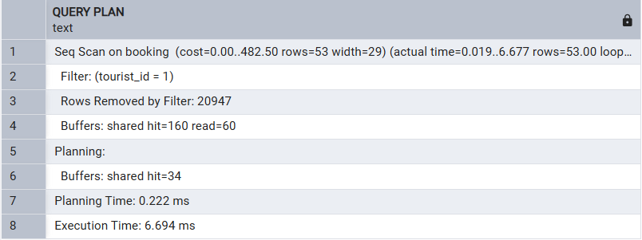

תוכנית ביצוע אחרי יצירת האינדקס:

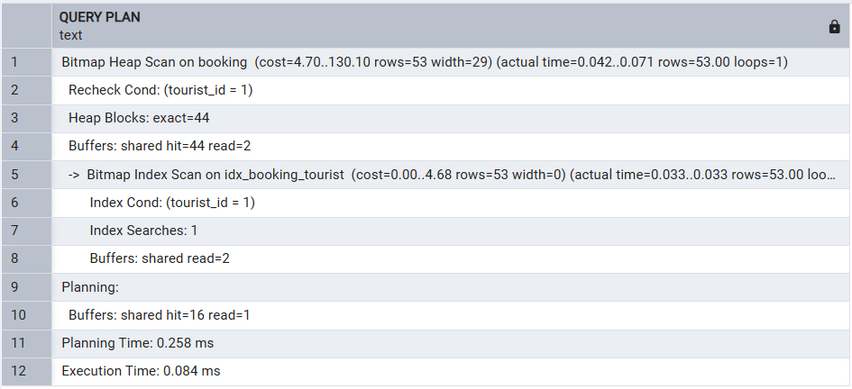

הסבר תוצאות:
לפני יצירת האינדקס, השאילתה ביצעה סריקה מלאה של טבלת ההזמנות ועברה על עשרות אלפי רשומות כדי למצוא את ההזמנות של המשתמש, דבר שגרם לזמן ריצה גבוה יחסית.
לאחר יצירת האינדקס, השאילתה השתמשה באינדקס כדי לאתר ישירות את ההזמנות של אותו משתמש, ללא מעבר על כל הטבלה, ולכן זמן הריצה ירד בצורה משמעותית מאוד.

2. אינדקס על מזהה העיר בטבלת מסעדות

אינדקס זה נוצר על עמודת מזהה העיר בטבלת המסעדות, במטרה לשפר את מהירות החיפוש של מסעדות לפי עיר ולאפשר גישה מהירה לנתונים.

תוכנית ביצוע לפני יצירת האינדקס:

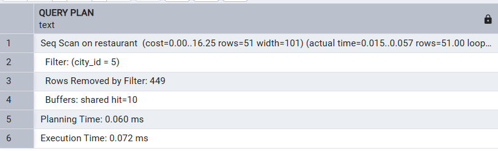

תוכנית ביצוע אחרי יצירת האינדקס:

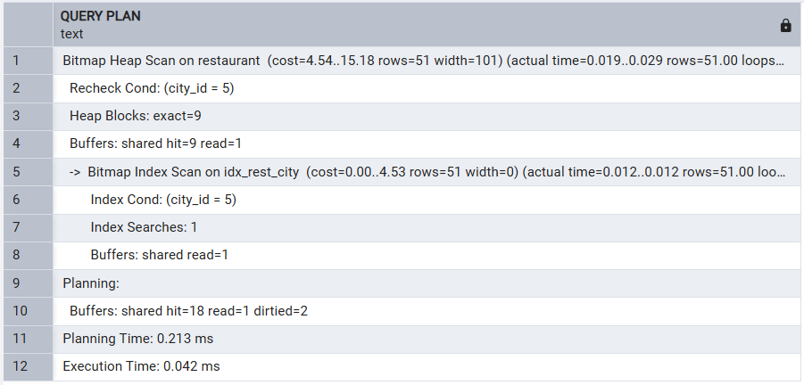

הסבר תוצאות:
לפני יצירת האינדקס, השאילתה סרקה את כל טבלת המסעדות וסיננה את הרשומות שאינן שייכות לעיר המבוקשת.
לאחר יצירת האינדקס, בסיס הנתונים השתמש באינדקס כדי לאתר רק את המסעדות בעיר הרלוונטית, וכך הופחתה כמות הנתונים שנבדקה בפועל, מה שהוביל לשיפור מסוים בזמן הריצה.

3. אינדקס על מזהה המסעדה בטבלת ביקורות

אינדקס זה נוצר על עמודת מזהה המסעדה בטבלת הביקורות, במטרה לשפר את מהירות החיפוש של ביקורות לפי מסעדה.

תוכנית ביצוע לפני יצירת האינדקס:

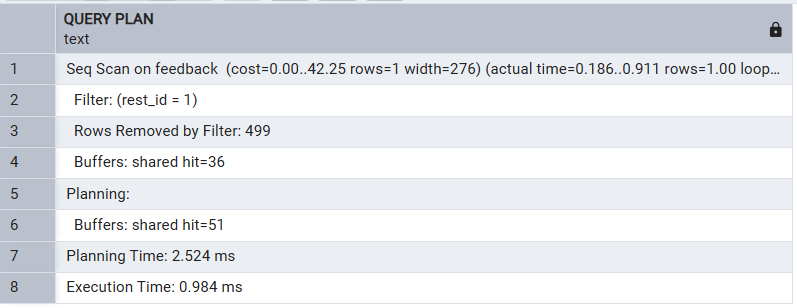

תוכנית ביצוע אחרי יצירת האינדקס:

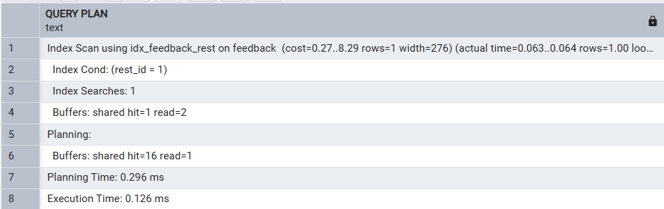

הסבר תוצאות:
לפני יצירת האינדקס, השאילתה עברה על כל טבלת הביקורות וסיננה את הרשומות שאינן שייכות למסעדה המבוקשת.
לאחר יצירת האינדקס, השאילתה הצליחה לגשת ישירות לביקורות של אותה מסעדה באמצעות האינדקס, ללא צורך בסריקה מלאה, ולכן זמן הריצה השתפר והביצוע הפך ליעיל יותר.
